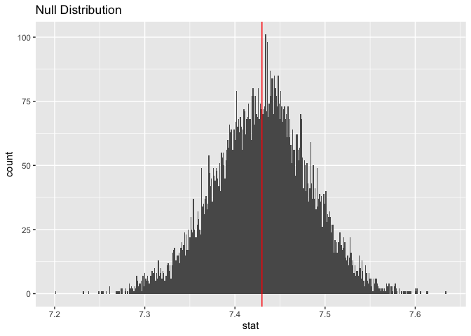
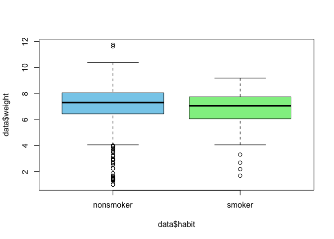

Lab 12 - Smoking during pregnancy
================
Fiona Wang
Apr 2 2025

### Load packages and data

``` r
library(tidyverse) 
library(tidymodels)
library(openintro)
```

``` r
data <- ncbirths
```

``` r
glimpse(data)
```

    ## Rows: 1,000
    ## Columns: 13
    ## $ fage           <int> NA, NA, 19, 21, NA, NA, 18, 17, NA, 20, 30, NA, NA, NA,…
    ## $ mage           <int> 13, 14, 15, 15, 15, 15, 15, 15, 16, 16, 16, 16, 16, 16,…
    ## $ mature         <fct> younger mom, younger mom, younger mom, younger mom, you…
    ## $ weeks          <int> 39, 42, 37, 41, 39, 38, 37, 35, 38, 37, 45, 42, 40, 38,…
    ## $ premie         <fct> full term, full term, full term, full term, full term, …
    ## $ visits         <int> 10, 15, 11, 6, 9, 19, 12, 5, 9, 13, 9, 8, 4, 12, 15, 7,…
    ## $ marital        <fct> not married, not married, not married, not married, not…
    ## $ gained         <int> 38, 20, 38, 34, 27, 22, 76, 15, NA, 52, 28, 34, 12, 30,…
    ## $ weight         <dbl> 7.63, 7.88, 6.63, 8.00, 6.38, 5.38, 8.44, 4.69, 8.81, 6…
    ## $ lowbirthweight <fct> not low, not low, not low, not low, not low, low, not l…
    ## $ gender         <fct> male, male, female, male, female, male, male, male, mal…
    ## $ habit          <fct> nonsmoker, nonsmoker, nonsmoker, nonsmoker, nonsmoker, …
    ## $ whitemom       <fct> not white, not white, white, white, not white, not whit…

``` r
boxplot.stats(data$fage)$out
```

    ## [1] 53 55

``` r
boxplot.stats(data$mage)$out
```

    ## [1] 50

``` r
boxplot.stats(data$weeks)$out
```

    ##  [1] 45 24 29 29 31 30 22 32 32 45 29 32 30 22 25 32 24 29 31 32 25 32 25 29 32
    ## [26] 31 22 31 45 26 30 26 26 45 28 28 28 31 30 26 20 32 31

``` r
boxplot.stats(data$visits)$out
```

    ##  [1]  0  2  2  0  0  0 23  2 30  0  0  2  2 30  0 30 24 30 25 26 30

``` r
boxplot.stats(data$gained)$out
```

    ##  [1] 76 75 68 72 70 70 80 85 70 68 72 70 85 77 75 70

``` r
boxplot.stats(data$weight)$out
```

    ##  [1]  1.50  2.63  1.56  1.69  2.88  1.38  2.69  2.50  3.75  2.69  1.00  1.19
    ## [13]  1.44  3.75  1.69  2.25  3.44  1.38  1.88  3.56  3.19  3.31  1.00 11.75
    ## [25]  2.94  1.31  2.88 11.63  3.00  1.44  1.50  3.81  2.88  2.25  1.63  3.25
    ## [37]  3.63  1.38  2.19  3.63

Looking at this tibble, there are a couple numerical variables: father’s
age, mother’s age, length of pregnancy in weeks, number of hospital
visits during pregnancy, weight gained by mother during pregnancy in
pounds, and weight of the baby at birth in pounds. The others are all
categorical. For the numerical variables, all of them have outliers.

### Exercise 1

There are 1000 cases in this dataset. THe cases are the information on
birth record in the state of North Carolina from 2004.

### Exercise 2

``` r
ncbirths_white <- data %>% 
  filter(whitemom == "white")
ncbirths_white %>% 
  summarise(mean_weight = mean(weight, na.rm = TRUE))
```

    ## # A tibble: 1 × 1
    ##   mean_weight
    ##         <dbl>
    ## 1        7.25

The mean weights of the white babies is 7.25 pounds.

### Exercise 3

I think it meets the criteria necessary to conduct simulation-based
inference. It is a large enough sample size, so we could simulate
samples easily. The observations are independent, I think.

### Exercise 4

``` r
set.seed(1232)
boot_df <- ncbirths_white %>% 
  specify(respons = weight) %>% 
  hypothesize(null = "point", mu = 7.43) %>% 
  generate(reps = 10000, type  = "bootstrap") %>% 
  calculate(stat = "mean")
glimpse(boot_df)
```

    ## Rows: 10,000
    ## Columns: 2
    ## $ replicate <int> 1, 2, 3, 4, 5, 6, 7, 8, 9, 10, 11, 12, 13, 14, 15, 16, 17, 1…
    ## $ stat      <dbl> 7.400042, 7.356289, 7.462143, 7.377507, 7.431695, 7.368221, …

Now, let’s plot the graph.

``` r
ggplot(data = boot_df, mapping = aes(x = stat)) +
  geom_histogram(binwidth = 0.001) +
  labs(title = "Null Distribution") +
  geom_vline(xintercept = 7.43, color = "red")
```

<!-- -->

It seems to be pretty normally distributed (or a little left skewed),
and centered around 7.43.

``` r
boot_df %>% 
  summarize(lower = quantile(stat, .025),
            uppter = quantile(stat, .975))
```

    ## # A tibble: 1 × 2
    ##   lower uppter
    ##   <dbl>  <dbl>
    ## 1  7.32   7.53

``` r
boot_df %>% 
  summarize(p_value = mean(abs(stat - 7.43) >= abs(7.25 - 7.43)))
```

    ## # A tibble: 1 × 1
    ##   p_value
    ##     <dbl>
    ## 1  0.0007

It seems like the p-value is 0.0007. There is very few instances in the
null distribution that we see a difference as large as the one we
observed in the current dataset. The null’s mean is 7.43, the observed
mean is 7.25, which is a 0.18 difference. In our 10,000 bootstrap
results, there were few instances where they had a bigger than 0.18
difference. So, it is very unlikely to see an instance as extreme as
ours. Thus, we conclude that the weight of White babies in NC in 2004 is
significantly lighter than the White babies in 1995.

### Exercise 5

``` r
boxplot(data$weight ~ data$habit, data = data,
        col = c("skyblue", "lightgreen"))
```

<!-- -->

From the boxplot, we see that the weight of the babies whose mothers
were nonsmokers on average was heavier than that of the babies whose
mothers were smokers.

### Exercise 6

``` r
ncbirths_clean <- data %>% 
  filter(!is.na(habit), !is.na(weight))
```

It seems like there is only one missing value.

### Exercise 7

``` r
ncbirths_clean %>% 
  group_by(habit) %>% 
  summarize(mean_weight = mean(weight))
```

    ## # A tibble: 2 × 2
    ##   habit     mean_weight
    ##   <fct>           <dbl>
    ## 1 nonsmoker        7.14
    ## 2 smoker           6.83

### Exercise 8

Write the hypotheses testing to see if the difference is significant.
H0: the average weight of babies born to smoking mothers and the average
weight of babies born to non-smoking mothers are not significantly
different. HA: the average weight of babies born to smoking mothers are
significantly lighter than babies born to non-smoking mothers.

### Exercise 9

``` r
t.test(weight ~ habit, data = ncbirths_clean)
```

    ## 
    ##  Welch Two Sample t-test
    ## 
    ## data:  weight by habit
    ## t = 2.359, df = 171.32, p-value = 0.01945
    ## alternative hypothesis: true difference in means between group nonsmoker and group smoker is not equal to 0
    ## 95 percent confidence interval:
    ##  0.05151165 0.57957328
    ## sample estimates:
    ## mean in group nonsmoker    mean in group smoker 
    ##                7.144273                6.828730

According to the t-test, the p-value is 0.019 \< 0.05. This means that
it is very unlikely to observe a data as extreme as ours, so the two
groups significantly differ from each other in the average weight of the
babies. The average weight of babies of non-smoker mothers is
significantly heavier than the average weight of babies of smoker
mothers.

### Exercise 10

The t-test already gives us the 95% CI around the difference: \[.052,
.580\].

``` r
set.seed(123)
boot_df2 <- ncbirths_clean %>%
  specify(weight ~ habit) %>%
  generate(reps = 10000, type = "bootstrap") %>%
  calculate(stat = "diff in means", order = c("nonsmoker", "smoker"))
ci <- boot_df2 %>%
  get_confidence_interval(level = 0.95, type = "percentile")
print(ci)
```

    ## # A tibble: 1 × 2
    ##   lower_ci upper_ci
    ##      <dbl>    <dbl>
    ## 1   0.0591    0.578

From the bootstrap the confidence interval is a little different from
what the t-test gave me. \[.059, .580\].

### Exercise 11

From my experience, I would use median cut-offs because that’s what I
did when determining low and high SES groups. We can divide mothers
equally into two groups.

``` r
median_age <- median(data$mage, na.rm = TRUE)
median_age
```

    ## [1] 27

The median age of mothers is 27, and that’s the cutoff if I were to
determine it. For mothers who are younger than 27, they are younger
mothers, for mothers who are 27 or older, they are mature mothers.

### Exercise 12
